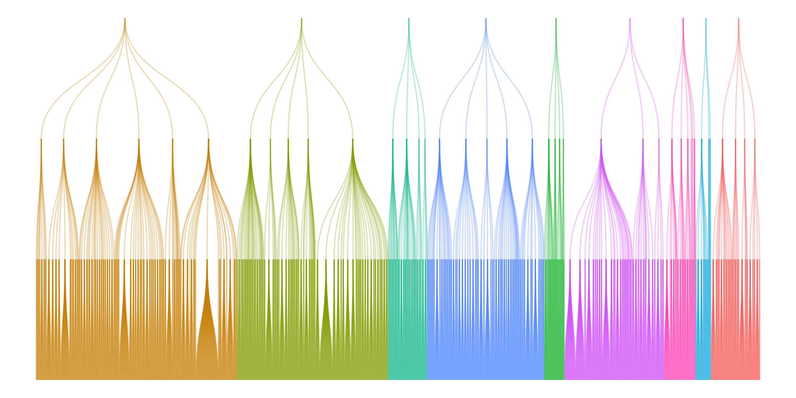

# Hierarchical Job Ads Classifier 0.1.0

Historical README preserved from the original project line.



Repository with hierarchical classifier of 6 digits occupation codes ([KZiS 2023, as of 2024-07-31](https://psz.praca.gov.pl/rynek-pracy/bazy-danych/klasyfikacja-zawodow-i-specjalnosci)).

## Authors

- Maciej Beręsewicz
- Marek Wydmuch
- Herman Cherniaiev
- Robert Pater

## Installation

Create a virtual environment:

```bash
python -m venv venv
source venv/bin/activate
python -m pip install --upgrade pip
```

Install PyTorch first. The original project expected the user to choose a machine-specific build manually, for example:

```bash
pip install torch
```

Then install the remaining dependencies:

```bash
pip install -r requirements-0.1.0.txt
```

## Running the script

Script arguments for training and prediction:

```text
usage: main.py [options] classifier command

commands:
  fit
  predict

classifiers:
  LinearJobOffersClassifier
  TransformerJobOffersClassifier
```

The original examples used command lines such as:

```bash
python main.py fit LinearJobOffersClassifier \
  -x train_test_data/example/x_train.txt \
  -y train_test_data/example/y_train.txt \
  -h train_test_data/example/classes.tsv \
  -m example_model
```

```bash
python main.py fit TransformerJobOffersClassifier \
  -x train_test_data/example/x_train.txt \
  -y train_test_data/example/y_train.txt \
  -h train_test_data/example/classes.tsv \
  -m example_model \
  -t allegro/herbert-base-cased \
  -mm bottom-up \
  -l 1e-5 \
  -w 0.01 \
  -e 10 \
  -b 8
```

## Original dependency bundle

The original repository pinned:

- `click==8.0.3`
- `napkinxc==0.6.2`
- `numpy==1.24.3`
- `pandas==2.2.2`
- `pyreadr==0.5.2`
- `pystempel==1.2.0`
- `pytorch_lightning==1.9.5`
- `scikit_learn==1.2.2`
- `scipy==1.8.0`
- `stop_words==2018.7.23`
- `torchmetrics==1.4.1`
- `transformers==4.44.2`

This file is intentionally preserved as a historical reference. For a maintained install path, use [README-0.2.0.md](README-0.2.0.md).

## Citation

If you use this repository, please cite:

Beręsewicz, M., Wydmuch, M., Cherniaiev, H., and Pater, R. (2026). *Multilingual Hierarchical Classification of Job Advertisements for Job Vacancy Statistics*. Journal of Official Statistics, 42(1), 23-61. https://doi.org/10.1177/0282423X251395400
